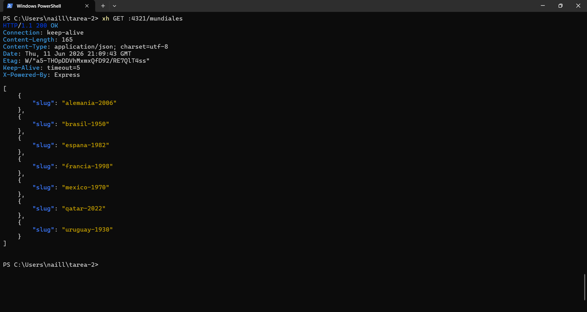
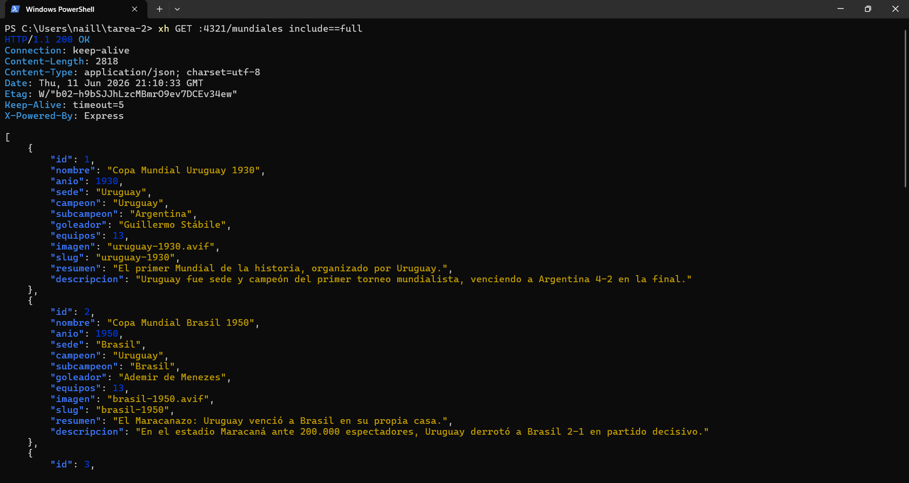
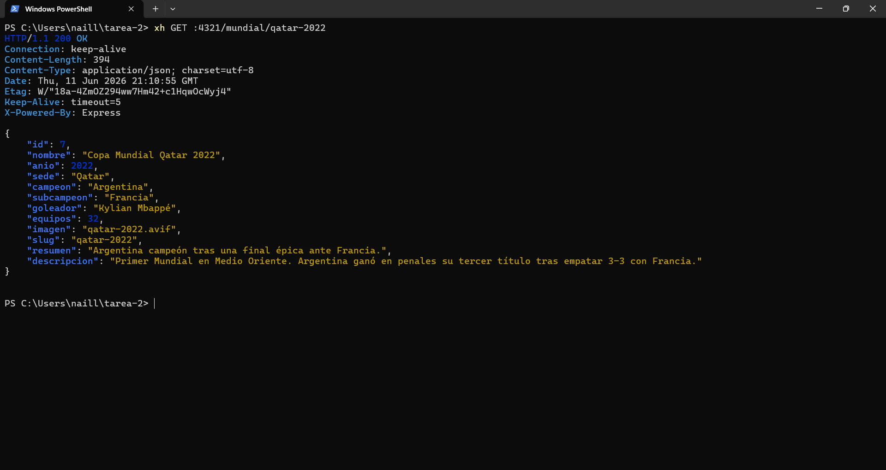
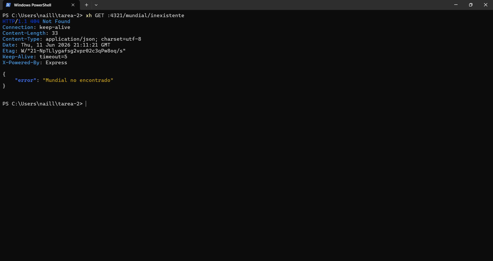
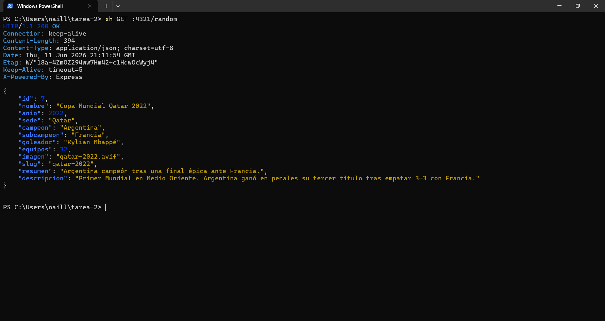
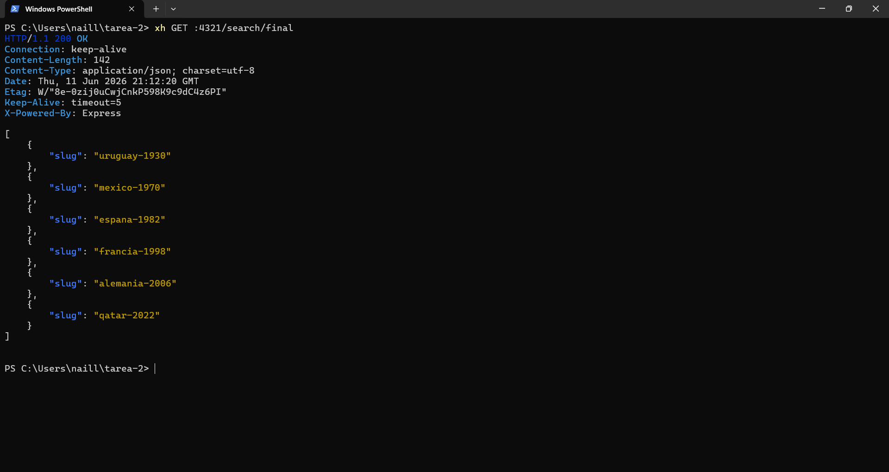
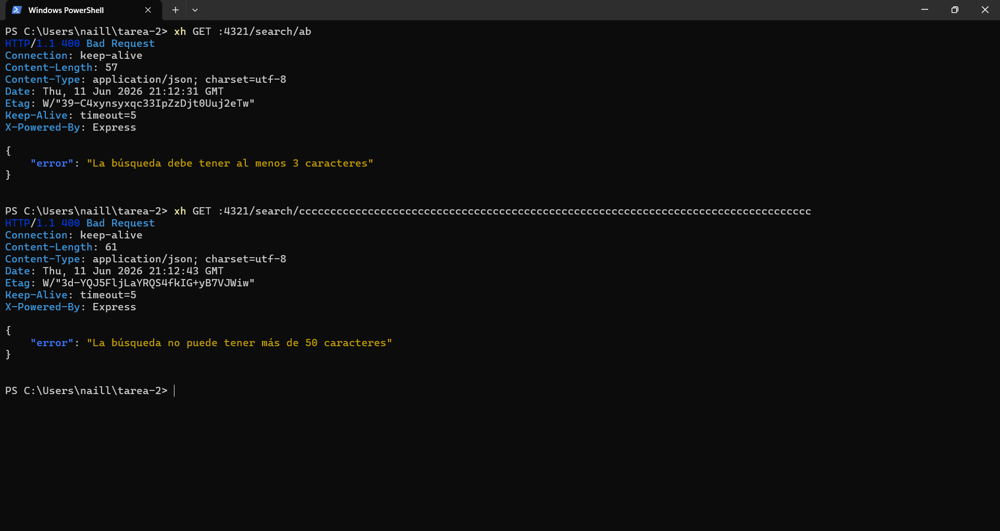
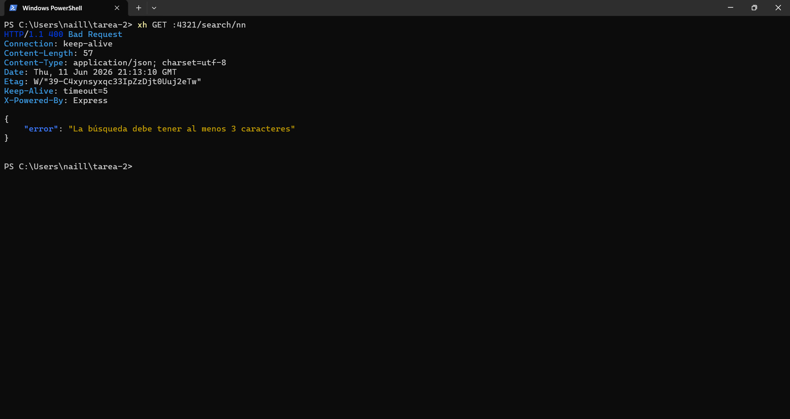

# API Copa Mundial FIFA — Lab 14

## Requisitos
- Node.js 22+
- pnpm

## Instalación
pnpm install

## Crear y poblar la base de datos
node data/createdb.js

## Ejecutar el servidor
pnpm dev

## Rutas disponibles
| Ruta               | Descripción                          |
|--------------------|--------------------------------------|
| /                  | Info de la API                       |
| /mundiales         | Lista de slugs (o ?include=full)     |
| /mundial/:slug     | Detalle de una edición               |
| /campeon/:pais     | Slugs de mundiales ganados por país  |
| /random            | Edición aleatoria                    |
| /search/:text      | Búsqueda por texto (mín. 3 chars)    |
| /imagenes/*        | Imágenes estáticas                   |

## Imagenes

A continuación se muestran las ejecuciones de las rutas y capturas correspondientes:

1. `xh GET :4321/mundiales`

	

2. `xh GET :4321/mundiales include==full`

	

3. `xh GET :4321/mundial/qatar-2022`

	

4. `xh GET :4321/mundial/inexistente`  # -> 404 JSON

	

5. `xh GET :4321/campeon/Argentina`

	

6. `xh GET :4321/random`

	

7. `xh GET :4321/search/final`

	

8. `xh GET :4321/search/ab`

	

9. Captura adicional

	

